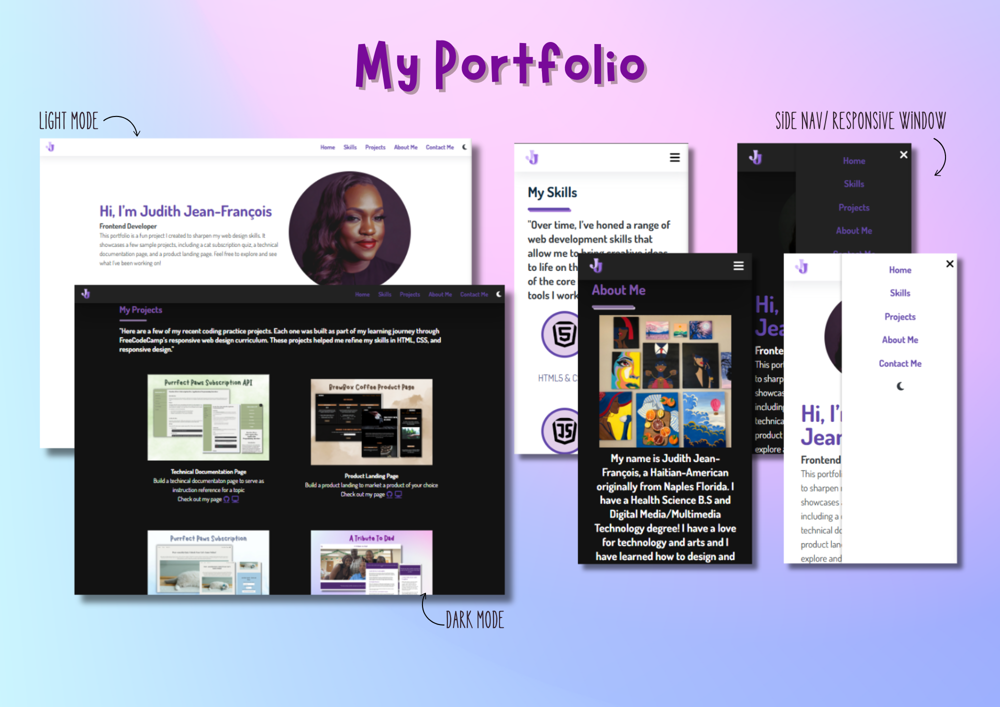

# Practice Portfolio for FreeCodeCamp

## Table of contents

- [Overview](#overview)
  - [The challenge](#the-challenge)
  - [Screenshot](#screenshot)
  - [Links](#links)
- [My process](#my-process)
  - [Built with](#built-with)
  - [What I learned](#what-i-learned)

## Overview

This repository showcases my portfolio website that highlights my web development skills and projects. The goal was to create a visually appealing and functional portfolio to present myself to potential employers and showcase my abilities as a web developer.

### The challenge

The challenge was to build a responsive, interactive, and aesthetically pleasing portfolio that effectively highlights my skills, projects, and contact information.

Features of the portfolio include:

- Responsive Design: The website adapts to different screen sizes for desktop, tablet, and mobile views.
- Navigation: Smooth scroll navigation with a sticky header.
- Skills Section: Displays a list of technologies and skills I've worked with.
- Project Section: A display of key projects I’ve worked on with links to GitHub repositories and live demos.
- Contact Form: A contact form that allows users to reach out for opportunities.
- Dark Mode: A dark mode toggle to enhance the user experience during night-time browsing.

### Screenshot

### Links

- Solution URL: [https://github.com/Jud1th1/mockportfolio] https://github.com/Jud1th1/mockportfolio
- Live Site URL: []

## My process

1. **Conceptualization**: The first step involved identifying what sections to include in my portfolio and how to structure the layout, ensuring all essential details about my skills and projects were easily accessible.

2. **Design and Styling**: I used CSS3 and Flexbox to create a responsive design, focusing on usability and visual hierarchy. I also added dark mode support to enhance accessibility for users browsing at night.

3. **Frontend Development**: I structured the site using HTML5 for semantic markup and CSS for layout and styling. JavaScript was used to implement the dark mode toggle and smooth scroll navigation.

4. **Testing and Debugging**: I thoroughly tested the portfolio across multiple devices and browsers to ensure it worked seamlessly on mobile, tablet, and desktop. I focused on fixing any layout issues and ensuring responsiveness.

5. **Final Adjustments**: Based on user feedback and testing, I made tweaks to improve the design, functionality, and overall polish of the portfolio.

### Built with

- HTML5: For the structure of the portfolio
- CSS3: For styling, layout, and animations
- Flexbox: For a responsive, flexible layout
- JavaScript: For adding interactivity like dark mode, side bar navigation and smooth scrolling
- Mobile-first Workflow: Designed with mobile users in mind, scaling up to larger screen sizes

### What I learned

During the development of this project, I learned several valuable things:

- **Dark Mode**: Toggle: How to integrate a dark mode feature using JavaScript to enhance the user experience.
- **Smooth Scroll Navigation**: Adding smooth scroll functionality to improve the usability of the navigation bar.
- **CSS Transitions**: Implementing smooth transitions for visual elements like background color changes in dark mode.
